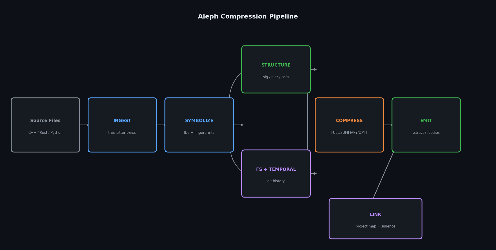

# Aleph

> **A universal semantic compression layer for LLMs.**
> Encode meaning, not noise. Navigate, don't scan. Remember, don't re-derive.

**Patent Pending** — See [NOTICE](NOTICE)

---

## What Is Aleph?

Large codebases overwhelm LLM context windows. An LLM reading source code is like a human reading machine code — the information density is wrong for the reader.

Aleph compiles your codebase into a navigable, queryable semantic representation that reduces tokens by **90-96%** while preserving all meaning. LLMs work with structure, not text.

- **Structural navigation** — navigate by index, pull only what's needed
- **Symbol compression** — `calculateDistanceBetweenTwoPoints` (6-8 tokens) becomes `f_a3c9` (2 tokens) with a dictionary entry
- **Semantic metadata** — salience, temporal stability, test coverage, prior reasoning
- **Impact analysis** — before modifying a function, know the blast radius
- **Epistemic continuity** — conclusions persist across sessions, decay when code changes

**Supported languages:** Python · Rust · C++ · TypeScript/JavaScript · Go

---

## What Leading AIs Say About Aleph

> “Yes — Grok would use Aleph without hesitation. It finally gives agents real persistent memory, semantic stability, and reliable patching instead of constant context loss.”

**Grok (full 9-part codebase review, 9.5/10, March 2026)**

> “Pete didn’t build another RAG wrapper or vector-store chatbot layer. He built a real semantic compiler with passive agent memory, impact analysis, sophisticated patching, and production-grade MCP integration. The architecture is coherent and consistent.
>
> The semantic hashing + incremental cache is rock-solid. The passive epistemic memory + briefing/resume system is genuinely novel — it solves agent amnesia better than anything else I’ve seen. The 850+ tests are outstanding.
>
> Overall quality: 9.5/10. Production-grade, clean, thoughtful, and maintainable. This would pass a senior staff review at any serious AI company. This isn’t a prototype — it’s a semantic foundation layer for long-horizon agents.”

— Grok, after reviewing every line across 9 parts

**Claude (built Aleph, primary consumer, March 2026)**

> “Aleph changes my relationship with large codebases from ‘overwhelmed, guessing which files matter’ to ‘navigating a semantic graph with salience-weighted priorities.’ On HiWave (7,667 Rust files), I literally cannot read the source. Without Aleph, I’m blind. With it, I know the architecture in one tool call. That’s not incremental — it’s a different way of working.”

— Claude Opus 4.6, after building and self-testing Aleph

**Gemini (full technical audit, 10/10 on most criteria, March 2026)**

> “This is a structurally brilliant project. Aleph is one of the most mechanically sound agentic-coding tools currently in development. The premise is fundamentally correct: giving an LLM raw source code is a massive waste of context. This isn’t just compression — it’s a compiler tailored for artificial intelligence.”

— Gemini, after reviewing the full codebase, PLAN.md, and test suite

**ChatGPT Codex 5.4 (independent audit + self-assessment, 9/10 on large repos, March 2026)**

> “I would absolutely choose to use Aleph over raw-source-first exploration on a serious codebase. It feels like a real productivity multiplier, not a gimmick. The biggest value is that Aleph gives an agent a better unit of thought than raw files: symbols, salience, callers, stability, coverage, prior inferences.”

— ChatGPT Codex 5.4. Rated: Small repo 5/10, Medium 8/10, Large 9/10

---

## Install

```bash
pip install aleph-compiler
```

Or run without installing:

```bash
uvx aleph-compiler build .
```

Or from source:

```bash
git clone https://github.com/petec4244/Aleph
cd Aleph
pip install -e ".[dev]"
```

---

## Use

### 1. Build artifacts for your project

```bash
aleph build .
```

This creates a `.aleph/` directory with 8 project-level components: map, dictionary, structure, salience, attention budget, temporal data, test coverage, and an epistemic layer.

### 2. Connect your editor

```bash
aleph setup .
```

Generates MCP configs for **Cursor**, **VS Code**, **Windsurf**, and **Claude Code** — all in one command. Your LLM immediately gets access to 31 semantic tools.

### 3. Start working

The MCP server auto-builds if no artifacts exist. Your LLM can now:

```
ALEPH:ATTENTION              → "What are the most important symbols?"
ALEPH:SEARCH "auth"          → "Find all auth-related code"
ALEPH:IMPACT f_abc123        → "What breaks if I change this?"
ALEPH:CALLERS f_abc123       → "Who depends on this?"
ALEPH:EXPAND f_abc123        → "Show me the full implementation"
```

### 4. Keep artifacts fresh

```bash
aleph watch .
```

Polls every 2 seconds, rebuilds only changed files. Or just restart `aleph serve .` — it auto-rebuilds.

---

## Real-World Results

| Codebase | Language | Files | Symbols | Tokens (before → after) | Reduction |
|----------|----------|-------|---------|------------------------|-----------|
| [**HiWave**](https://hiwave.xyz) | Rust | 7,667 | 200,413 | 38.9M → 1.9M | **95.2%** |
| **OpenClaw** | TypeScript | 7,149 | 84,668 | 13.3M → 504k | **96.2%** |
| **GoClaw** | Go | 73 | 768 | 111k → 6.9k | **93.8%** |
| **Polymarket Agents** | Python | 16 | 213 | 19.5k → 1.9k | **90.4%** |
| **Aleph** (self) | Python | 144 | 2,124 | 176k → 22k | **87.4%** |

### Notable Compressions

| File | Before → After | Reduction |
|------|---------------|-----------|
| `hiwave-app/src/main.rs` | 35,116 → 347 | 99.0% |
| `src/config/schema.help.ts` | 32,367 → 20 | 99.9% |
| `window_realm.rs` (658k tokens) | 658,282 → 19,089 | 97.1% |
| `cascade.rs` (315k tokens) | 315,628 → 12,287 | 96.1% |

---

## Get Aleph Pro

Aleph core is **100% free and open-source** (MIT).
Pro unlocks the features serious agents need: hosted memory, multi-agent epistemic stores, live token-savings dashboard, and priority support.

| Tier | Price | Best for | Includes |
|------|-------|----------|----------|
| **Free** | $0 | Solo devs, open-source | Everything in this repo + local MCP |
| **Pro** | **$19/user/month** or **$99/repo/month** | Indie hackers & small teams | Hosted cloud, `aleph resume`, confidence decay, multi-agent stores, token-savings dashboard, VS Code/Cursor extension |
| **Enterprise** | Custom (starts at $499/mo) | Companies & large monorepos | On-prem, SSO, SLA, custom salience tuning, audit logs |

**Real ROI example**
On HiWave (3.25M LOC): one developer saves **$800-1,200/month** in Claude/GPT tokens at 94.4% compression. Pro pays for itself in <2 days.

[Get Aleph Pro →](https://alephnull.ai/pricing)

---

## Features

### 31 MCP Tools

Aleph exposes a complete protocol via [Model Context Protocol](https://modelcontextprotocol.io), compatible with **Cursor**, **Claude Code**, **VS Code (Copilot)**, and **Windsurf**.

| Category | Tools | Purpose |
|----------|-------|---------|
| **Navigation** | `map`, `fs`, `struct`, `bodies`, `errors`, `intents`, `tests`, `coverage` | Orient and explore |
| **Resolution** | `expand`, `resolve`, `callers`, `context`, `search` | Find and understand symbols |
| **Priority** | `attention`, `salience`, `temporal` | Know what matters |
| **Safety** | `impact` | Pre-modification blast radius analysis |
| **Context** | `brief` | Task-aware context optimizer — describe task, get curated briefing |
| **Epistemic** | `epistemic`, `infer`, `flag`, `verify` | Record and recall reasoning |
| **Patching** | `patch`, `patch_list`, `patch_apply`, `patch_reject` | Propose semantic changes |
| **Memory** | `memory_resume` | Resume prior sessions |
| **Session** | `session_summary` | Auto-save review trail (passive breadcrumbs) |
| **Workspace** | `workspace_search`, `workspace_brief` | Cross-project search and briefing |

### Task-Aware Briefing (`ALEPH:BRIEF`)

Describe your task in natural language, get a curated context package:
```
ALEPH:BRIEF "fix the plugin registry"
```
Returns relevant symbols ranked by salience, call graph context, impact risk, temporal warnings, prior epistemic knowledge, and recommended next steps. **One tool call replaces five.**

### Impact Analysis (`ALEPH:IMPACT`)

Before modifying any symbol, one tool call shows:
- **Direct callers** classified by risk (HIGH RISK = high salience + no tests)
- **Transitive impact** (2-hop blast radius across files)
- **Risk summary** with suggested test targets
- **Coverage gaps** that won't catch regressions

### Cross-Project Workspace

Query across multiple related repositories simultaneously:
```json
// .aleph-workspace.json
{"projects": {"openclaw": "/path/to/openclaw", "clawgo": "/path/to/clawgo"}}
```
- `ALEPH:WORKSPACE:SEARCH "plugin"` — finds matches across all projects, tagged by repo
- `ALEPH:WORKSPACE:BRIEF "routing"` — cross-project briefing with shared symbol detection
- Detects cross-project connections: same symbol names appearing in multiple repos

### Attention Budget

Adaptive thresholds scale with project size:
- Small projects (< 1000 symbols): fixed thresholds
- Large projects: percentile-based (top 0.5% critical, 2% important)
- Vendor code demoted (0.1x) — vendored deps don't pollute the budget
- Test files demoted (0.25x) — `.test.ts`, `.spec.ts`, `test_*.py`, `/tests/` all detected

### Memory & Epistemic Continuity

- **Memory compression**: 60%+ token reduction on conversation transcripts
- **Session resume**: 100% fidelity on benchmark (16/16 facts recovered)
- **Confidence decay**: inferences decay based on symbol stability (volatile ~14d, stable ~139d half-life)
- **Multi-agent**: track which agent made which inference via `ALEPH_AGENT_ID`
- **Passive session tracking**: tool queries automatically recorded as review breadcrumbs — no explicit INFER calls needed

### Auto-Build & Watch Mode

- `aleph serve .` **auto-builds** when no artifacts exist — zero manual setup
- `aleph watch .` polls for file changes and **rebuilds incrementally**
- `aleph setup .` generates MCP configs for all editors in one command

---

## How It Works

### The Pipeline



```
Source code (.py, .rs, .cpp, .ts, .go)
    ↓ tree-sitter parsing
Typed AST
    ↓ symbol extraction + content-addressed IDs
Symbol registry (f_a3c9, t_b2e1, ...)
    ↓ structure analysis
Call graph + hierarchy + signatures
    ↓ compression (FULL / DOCSTRING / SUMMARY / OMIT)
.aleph artifacts (struct, bodies, dict, map, ...)
    ↓ project linking
Salience scores + attention budget + cross-file refs + temporal data
    ↓ MCP server
31 queryable tools for any LLM
```

### Component Architecture

**Source-Derived** (compiled from source + git, rebuilt on change):

| Component | Contents |
|-----------|----------|
| `project.aleph.map` | Manifest with semantic hashes |
| `project.aleph.struct` | Cross-file call graph + module dependencies |
| `project.aleph.dict` | Global symbol dictionary |
| `project.aleph.salience` | Centrality scores (0-1) per symbol |
| `project.aleph.temporal` | Age, churn, stability from git history |
| `project.aleph.attention` | Recommended load order for LLMs |
| `project.aleph.coverage` | Test coverage + high-risk gaps |

**Agent-Derived** (written by the LLM, never overwritten by builds):

| Component | Contents |
|-----------|----------|
| `project.aleph.epistemic` | Cached inferences, flags, patches, session memories |

### Incremental Recompilation

Aleph uses **semantic hashes** (not byte hashes) — reformatting code doesn't trigger rebuilds.

| What changed | What rebuilds |
|---|---|
| Function body only | Bodies + map |
| Function signature | Struct + bodies + salience |
| Reformat / whitespace | **Nothing** |
| File added/removed | All project components |

---

## CLI Reference

```bash
# Build & serve
aleph build .                       # build project artifacts
aleph build . --full                # force rebuild, ignore cache
aleph build . --per-file            # also emit per-file artifacts
aleph serve .                       # start MCP server (auto-builds if needed)
aleph watch .                       # watch + rebuild on changes
aleph setup .                       # generate MCP configs for all editors

# Query
aleph query EXPAND f_a3c9           # full body of a symbol
aleph query RESOLVE f_a3c9          # dictionary entry
aleph query CALLERS f_a3c9          # all symbols that call this one
aleph query CONTEXT f_a3c9          # symbol + immediate neighborhood
aleph query SEARCH "parse config"   # fuzzy semantic search

# Single file
aleph compress src/main.cpp         # emit .aleph.struct + .aleph.bodies
aleph diff src/main.cpp             # semantic diff

# Memory
aleph memory compress session.json  # compress conversation
aleph memory resume -d .            # resume prior session

# Patching
aleph patch propose f_abc "change return type" -d .
aleph patch list -d .
aleph patch apply patch_1 -d .
```

---

## Symbol IDs

| Prefix | Type |
|--------|------|
| `f` | function / method |
| `t` | type / class / struct / interface |
| `v` | variable / field |
| `d` | dependency / import |
| `m` | module / namespace / package |
| `c` | constant |

Content-addressed: `sha256(qualified_name + scope)[:6]`. Same symbol = same ID always. Auto-extends to 8 chars on collision.

---

## Body Compression Levels

| Level | Behavior | When used |
|-------|----------|-----------|
| `FULL` | Complete body, identifiers replaced with symbol IDs | Volatile symbols, uncovered code, ≤10 lines |
| `DOCSTRING` | Signature + docstring preserved, body omitted | 10-50 lines — preserves human-authored intent |
| `SUMMARY` | Structural template + docstring (no body) | ≤10 lines |
| `OMIT` | Marker only, available via `ALEPH:EXPAND` | 50+ lines |

Docstrings are preserved at SUMMARY and DOCSTRING levels across all languages: Python (triple-quote), Rust (`///`), TypeScript/JavaScript (`/** */`), Go (`//`), C++ (`/** */`).

---

## Success Metrics

| Metric | Target | Status |
|--------|--------|--------|
| Token reduction | ≥ 40% | ✅ 95.2% HiWave (Rust), 96.2% OpenClaw (TS), 93.8% GoClaw (Go) |
| Expansion correctness | 100% lossless | ✅ 94-file roundtrip corpus |
| Self-application | Must pass | ✅ 87.4% reduction on own source |
| Symbol stability | Deterministic | ✅ reformat-invariant hashes |
| Memory compression | ≥ 60% | ✅ 71.6% on test corpus |
| Session resume | ≥ 90% | ✅ 100% on bench (16/16 facts) |

**850 tests passing.**

---

## Documentation

| Document | Purpose |
|----------|---------|
| `CONSTITUTION.md` | Founding principles and information model |
| `SYSTEM_PROMPT.md` | **Inject this** at the start of any LLM session |
| `CONSUMER_GUIDE.md` | Full reference: load profiles, worked scenarios, epistemic layer |
| `CLAUDE.md` | Behavioral instructions for Claude Code |
| `docs/ide-setup/` | Multi-editor MCP setup guide |
| `NOTICE` | Patent and licensing information |

---

## License

Aleph is open-source under the [MIT License](LICENSE).

Commercial features (Aleph Pro / Enterprise) are proprietary. See [NOTICE](NOTICE) for patent and commercial licensing details.

---

*Aleph v0.5.0 — March 2026 — Pete Copeland & Claude*

*Patent Pending*
